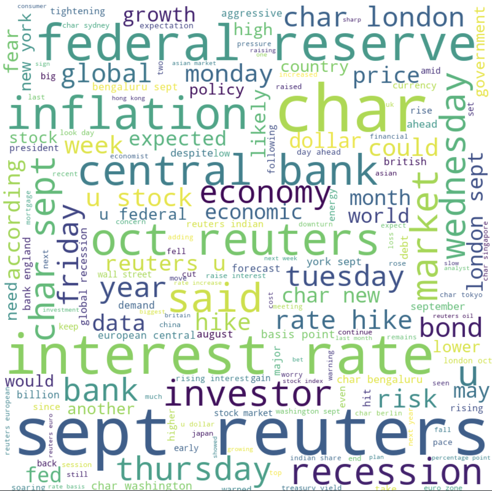

# Data Exploration in R

Data exploration is a vital process in the data science field. It is the first step in a data science project, and involves the utilization of data visualization tools and multiple statistical techniques to discover data characteristics and notice initial patterns.

During data exploration, or EDA (Exploratory Data Analysis), raw data is typically reviewed with a combination of automated data-exploration techniques to visually explore the data set, look for similarities, outliers, and patters. This helps in identifying relationships between different variables.

```{r}
library("dplyr")
library(tidyverse) # import necessary packages
library(readr)

```

```{r}
getwd()
```


```{r}
df <- read.csv("../../data/clean-data/Fredapi_clean.csv")
```

```{r}
head(df) # visualize the first few rows of our record dataframe
```


Now, let's create some plots to see if there are any noticeable patterns or outliers in our data.

```{r}
q <- ggplot(df, aes(x=unemployment_value, y=gdp_value)) + 
  labs(title = "Correlational Plot of GDP and Unemployment")
q + geom_jitter() + geom_smooth(method="lm", span = 0.2) + xlab("Unemployment Rate") + ylab("GDP value (100,000 USD)") 
```
```{r}
q <- boxplot(df$unemployment_value ~ df$recession, las = 2, horizontal = TRUE,
        col = 'steelblue',
        main = 'Unemployment Rate by Recession',
        xlab = "Recession",
        ylab = NULL)
```


This boxplot helps elucidate the unemployment rates in the US in periods of recession, and the unemployment rates in period where there isn't a recession taking place. From this, we can see that in period that there is no recession (0), the unemployment rate is significantly lower than in periods of recession. Recessions are period of severe economic downturn, and thus, to make up for the downturn and cut down on spending, companies often lay off mass numbers of people. This is the reason why unemployment rates tend to be significantly higher in periods of recession. The one outlier we see in this plot is that during the COVID-19 recession, when unemployment rates in the US skyrocketed to greater than 14%, the highest in US history for a very long time.

```{r}
#gdp_int <- as.integer(df['gdp_value'])
p<-ggplot(df, aes(x=gdp_value)) + 
  geom_histogram(color="black", fill="white")
p
```
```{r}
q <- ggplot(df, aes(x=unemployment_value, y=fed_funds_value)) + 
  labs(title = "Correlational Plot of Federal Funds Rate and Unemployment")
q + geom_jitter() + geom_smooth(method="lm", span = 0.2) + xlab("Unemployment Rate") + ylab("Federal Funds Rate") 
```


Again, we can see the relationship between the interest rates and unemployment rate. This plot shows us a very weak linear relationship, signifying higher unemployment rates when the interest rates are lower. This doesn't make complete sense to me, as when interest rates are low, people are investing more and companies are spending and thus hiring more, which would lead to a lower unemployment rate. However, this relationship is extremely weak, so it is hard to establish a correlation between the two variables solely based on this plot.

# News API Sentiment Analysis from Vader




The above plot is the word cloud from my News API, using Vader Sentiment Analysis. We can see that words such as 'economy', 'investor', 'interest rate', 'inflation', and others are quite common in the news, as all of them are terms related to economics and recessions. 
